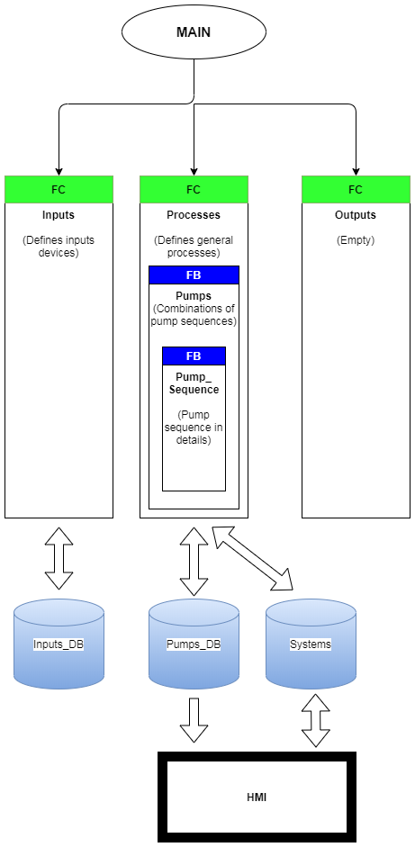

# Diaphragm-Pump-Sequence-Example
In this example project, you can change the diaphragm pump state into 4 categories:
* Disable
* Enable
* Run
* Maintenance

## System Requirements
```bash
- Totally Integrated Automation Portal
  - Version V15.1 Update 4
- STEP 7 Professional
  - Version V15.1 Update 4
- WinCC Advanced
  - Version V15.1 Update 4
```

## General Program Structure
The image below visualized the program structure.
* The **Inputs**, **Processes**, and **Outputs** block are FC.
* __Pumps__ block are situated inside __Processes__ block.
* __Pump_Sequence__ inside the __Pumps__ block is the core program that execute the pump sequences.



## Contributing
Any ammendment are welcome. For any changes, please open an issue first to discuss what you would like to change.

Please make sure to update tests as appropriate.

## License
[MIT](https://choosealicense.com/licenses/mit/)
