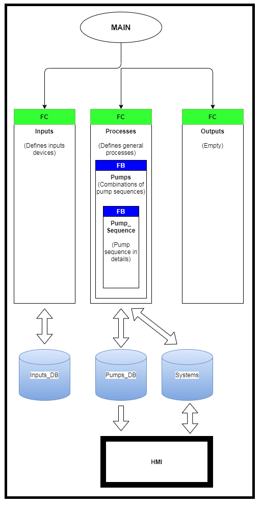

# Diaphragm-Pump-Sequence-Example
## This SIEMEN TIA V15.1 contains my an example for creating sequence for diaphragm pump.
### The sequence is created by Alex Fox.

**The diagram below shows the general structure for this example program:**

*You are free to download and modify this program. I'm really glad that you think my example is usefull.*
